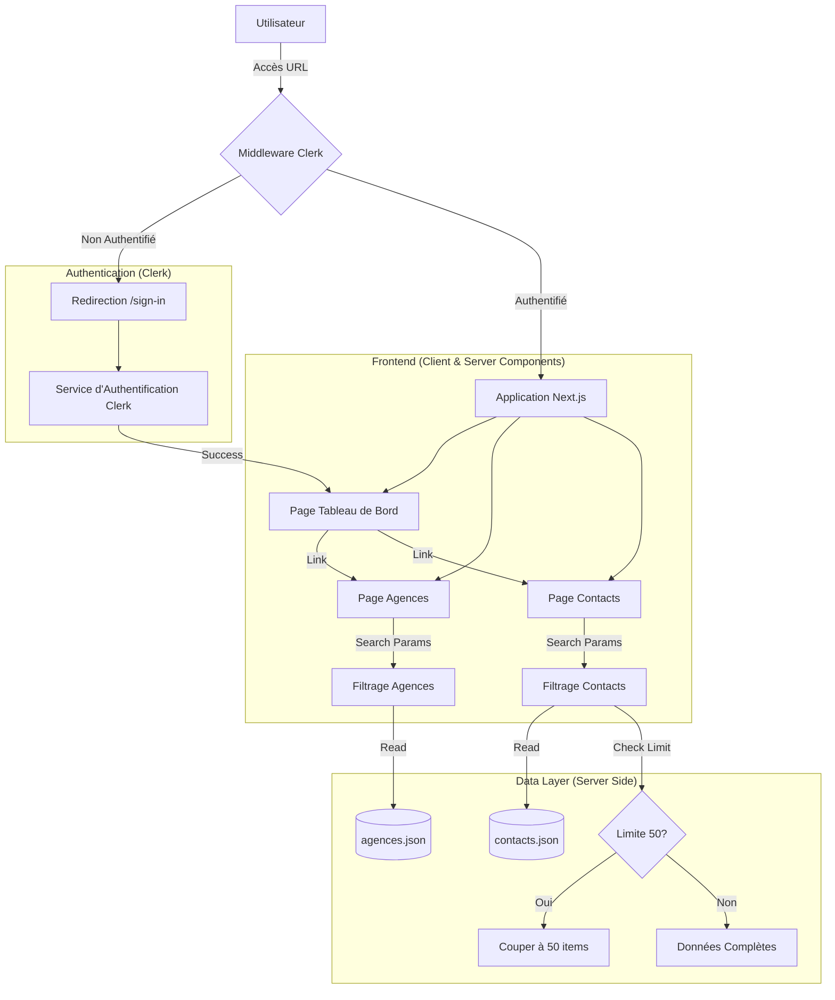

# Documentation Technique & Architecture

## Vue d'ensemble
Ce document détaille l'architecture technique de l'application Dashboard, les flux de données et les choix de conception.

## 1. Architecture du Système (System Design)

Le diagramme suivant illustre le flux utilisateur et l'architecture de l'application :

## 2. Modèle de Données

### Agence
Structure des données provenant de `agences.json` :
| Champ | Type | Description |
|-------|------|-------------|
| `name` | String | Nom de l'agence ou de la ville |
| `state` | String | État complet (ex: Washington) |
| `state_code` | String | Code de l'état (ex: WA) |
| `type` | String | Type d'entité (ex: City, County) |
| `population` | String | Population desservie |
| `website` | String | URL du site web officiel |

### Contact
Structure des données provenant de `contacts.json` :
| Champ | Type | Description |
|-------|------|-------------|
| `first_name` | String | Prénom |
| `last_name` | String | Nom de famille |
| `email` | String | Adresse email professionnelle |
| `phone` | String | Numéro de téléphone |
| `title` | String | Poste occupé |
| `department` | String | Département de rattachement |

## 3. Flux d'Authentification
L'authentification est gérée par **Clerk**.
- **Middleware** : `src/middleware.ts` protège toutes les routes sauf les pages publiques (sign-in, sign-up).
- **Composants** : `<SignIn />` et `<SignUp />` sont utilisés pour les formulaires.
- **Session** : La session est persistée via des cookies sécurisés gérés par Clerk.

## 4. Gestion de la Limite "Freemium"
La logique de limitation est implémentée côté serveur dans `src/app/contacts/page.tsx`.
1. Récupération de tous les contacts.
2. Filtrage par recherche (si applicable).
3. Application de la limite stricte (`slice(0, 50)`).
4. Si le nombre total de résultats > 50, une bannière "Upgrade" est affichée.

## 5. Stack Technique
- **Framework** : Next.js 16 (App Router)
- **Langage** : TypeScript
- **Styling** : Tailwind CSS v4
- **Icônes** : Lucide React
- **Déploiement** : Vercel (Edge Network)
