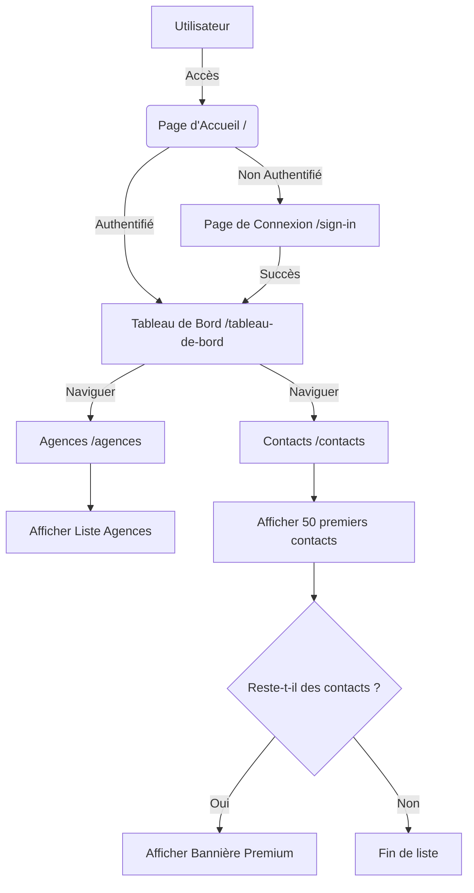

# Dashboard Stage - Take-Home Assignment

Application de tableau de bord avec authentification et gestion de limite de vue de contacts.

## Fonctionnalités

- **Authentification** : Sécurisée via Clerk.
- **Agences** : Visualisation de la liste complète des agences.
- **Contacts** : Visualisation des contacts (mode gratuit limité aux 50 premiers résultats).
- **Design Moderne** : Interface professionnelle avec Tailwind CSS et Lucide Icons.

## Installation

1.  Cloner le dépôt.
2.  Installer les dépendances :
    ```bash
    npm install
    ```
3.  Configurer les variables d'environnement dans `.env.local` :
    ```env
    NEXT_PUBLIC_CLERK_PUBLISHABLE_KEY=votre_clé_publique
    CLERK_SECRET_KEY=votre_clé_secrète
    NEXT_PUBLIC_CLERK_SIGN_IN_URL=/sign-in
    NEXT_PUBLIC_CLERK_SIGN_UP_URL=/sign-up
    ```
4.  Lancer le serveur de développement :
    ```bash
    npm run dev
    ```

## Architecture et Design

### Diagramme de Flux (System Design)



### Structure du Projet

- `src/app` : Pages et routes (App Router).
- `src/components` : Composants réutilisables (Navbar).
- `src/lib` : Logique métier (données, gestion des limites).
- `src/data` : Données importées depuis les fichiers CSV fournis (JSON).

## Technologies

- Next.js 16 (App Router)
- Clerk (Auth)
- Tailwind CSS v4
- Lucide React (Icons)
- TypeScript

## Déploiement

### Option 1 : Vercel (Recommandé)

Le moyen le plus simple de déployer cette application Next.js est d'utiliser la [Plateforme Vercel](https://vercel.com/new).

1.  Poussez votre code sur un dépôt Git (GitHub, GitLab, Bitbucket).
2.  Importez le projet dans Vercel.
3.  Ajoutez les variables d'environnement suivantes dans les paramètres du projet Vercel :
    - `NEXT_PUBLIC_CLERK_PUBLISHABLE_KEY`
    - `CLERK_SECRET_KEY`
    - `NEXT_PUBLIC_CLERK_SIGN_IN_URL`
    - `NEXT_PUBLIC_CLERK_SIGN_UP_URL`
4.  Déployez.

### Option 2 : Docker

Vous pouvez conteneuriser l'application pour la déployer sur n'importe quelle plateforme supportant Docker (Azure App Service, AWS ECS, DigitalOcean, etc.).

1.  Construire l'image Docker :
    > **Note** : Les variables `NEXT_PUBLIC_` doivent être disponibles lors de la construction.
    ```bash
    docker build \
      --build-arg NEXT_PUBLIC_CLERK_PUBLISHABLE_KEY=votre_clé \
      --build-arg NEXT_PUBLIC_CLERK_SIGN_IN_URL=/sign-in \
      --build-arg NEXT_PUBLIC_CLERK_SIGN_UP_URL=/sign-up \
      -t app-dashboard .
    ```

2.  Lancer le conteneur :
    ```bash
    docker run -p 3000:3000 \
      -e CLERK_SECRET_KEY=votre_clé_secrète \
      app-dashboard
    ```

