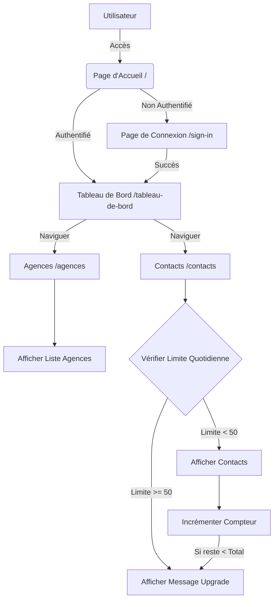

# Dashboard Stage - Take-Home Assignment

Application de tableau de bord avec authentification et gestion de limite de vue de contacts.

## Fonctionnalités

- **Authentification** : Sécurisée via Clerk.
- **Agences** : Visualisation de la liste des agences.
- **Contacts** : Visualisation de la liste des contacts avec une limite quotidienne de 50 vues.
- **Upgrade** : Message d'invitation à la mise à niveau lorsque la limite est atteinte.

## Installation

1.  Cloner le dépôt.
2.  Installer les dépendances :
    ```bash
    npm install
    ```
3.  Configurer les variables d'environnement dans `.env.local` :
    ```env
    NEXT_PUBLIC_CLERK_PUBLISHABLE_KEY=votre_clé_publique
    CLERK_SECRET_KEY=votre_clé_secrète
    NEXT_PUBLIC_CLERK_SIGN_IN_URL=/sign-in
    NEXT_PUBLIC_CLERK_SIGN_UP_URL=/sign-up
    ```
4.  Lancer le serveur de développement :
    ```bash
    npm run dev
    ```

## Architecture et Design

### Diagramme de Flux (System Design)



### Structure du Projet

- `src/app` : Pages et routes (App Router).
- `src/components` : Composants réutilisables (Navbar).
- `src/lib` : Logique métier (données, gestion des limites).
- `src/data` : Données mockées (JSON).

## Technologies

- Next.js 16 (App Router)
- Clerk (Auth)
- Tailwind CSS
- TypeScript
